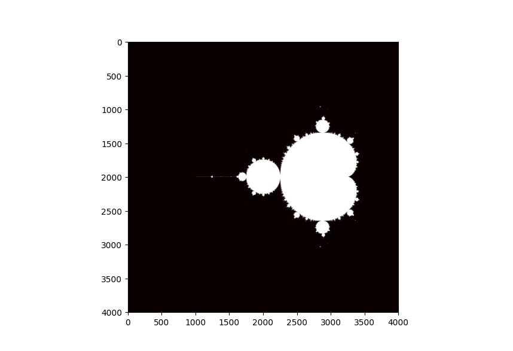
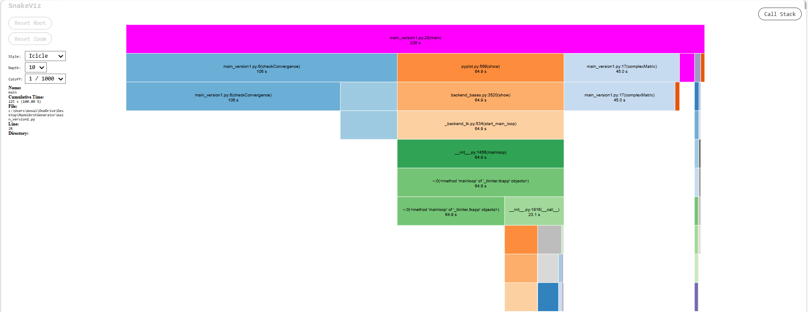
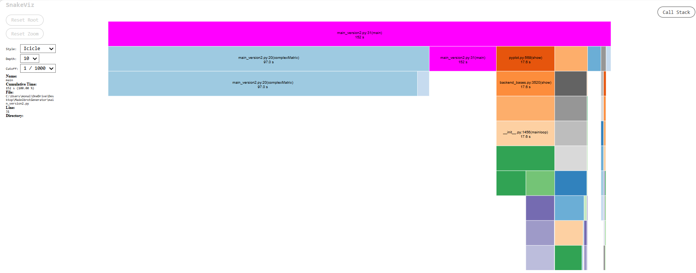
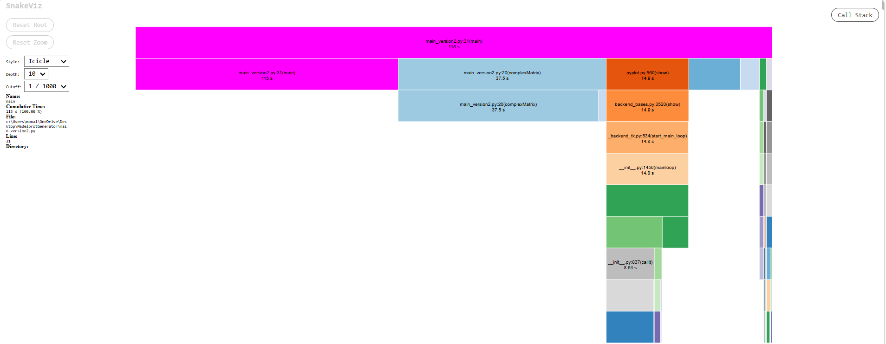
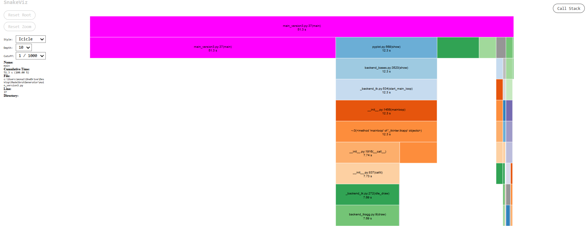
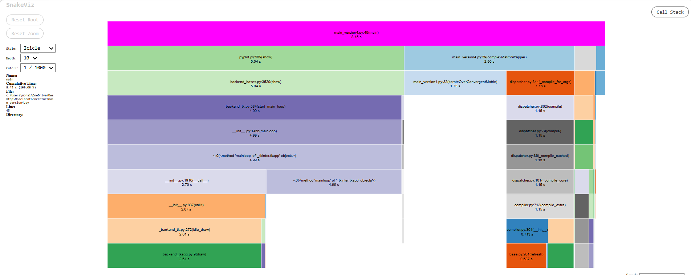

# Mandelbrot Set Generator

A Python implementation of the Mandelbrot Set with a focus on progressive performance optimisation. <br>
Took rendering time from **225 seconds down to 8.45 seconds** through profiling, JIT compilation, and numpy vectorisation.

Inspiration: [What's so special about the Mandelbrot Set? - Numberphile](https://www.youtube.com/watch?v=FFftmWSzgmk) <br>
[Beyond the Mandelbrot set, an intro to holomorphic dynamics - 3Blue1Brown](https://www.youtube.com/watch?v=LqbZpur38nw).

---

## What is the Mandelbrot Set?

The Mandelbrot Set is a set of complex numbers. For every point `c` on the complex plane, you ask one question:

> If I start at `z = 0` and keep applying the rule `z = z² + c`, does `z` stay bounded, or escape to infinity?

Points that stay bounded are **in the set** (in white). Points that escape are **outside** (coloured by how fast they escaped).
Do this for every point on a grid and you get the Mandelbrot Set.



---

## The Maths

The core iteration is:

```
z₀ = 0
zₙ₊₁ = zₙ² + c
```

Where `c = x + yi` is the point being tested. If `|z| ≥ 1000` at any point, it has escaped. If it survives 100 iterations, it is considered convergent.

---

## Project Structure

```
├── v1_mandelbrot.py      # Naive baseline - pure Python loops
├── v2_mandelbrot.py      # Optimisation 1 - @njit on checkConvergence
├── v3_mandelbrot.py      # Optimisation 2 - numpy broadcasting
├── v4_mandelbrot.py      # Optimisation 3 - @njit on outer loop
├── isConvergent.cpp      # Attempted C++ interop via ctypes
├── v1.prof               # cProfile data for v1
├── v2.prof               # cProfile data for v2
├── v3.prof               # cProfile data for v3
├── v4.prof               # cProfile data for v4
└── README.md
```

To view profiling data for any version:
```bash
pip install snakeviz
python -m snakeviz v1.prof
```

---

## Optimisation

### Version 1 - Baseline (225s)

Pure Python. Two nested loops to build the grid, another two nested loops in main to check convergence on every point. With a step size of 0.001, that's ~16 million points - each iterated up to 100 times in pure Python.
```python
def checkConvergence(number, z=0):
    iterNo = 0
    while (abs(z) < 1000) and (iterNo < 100):
        z = z*z + number
        iterNo += 1
    if abs(z) >= 1000: return False
    else: return True

def complexMatrix(x_start, x_end, y_start, y_end, stepSize):
    x_space = np.linspace(x_start, x_end, int((x_end - x_start)/stepSize) + 1)
    y_space = np.linspace(y_start, y_end, int((y_end - y_start)/stepSize) + 1)
    grid = []
    for y in y_space:
        row = []
        for x in x_space:
            row.append(x + y * 1j)
        grid.append(row)
    return grid
```

Used Python's built-in `cProfile` module to record exactly where time was being spent, then visualised it with `snakeviz`:

```bash
python -m snakeviz v1.prof
```

**Total time: 225s**


*v1 flame graph (checkConvergence and complexMatrix dominate)*

---

### Version 2 - JIT Compilation on checkConvergence (115s)

The profiler showed `checkConvergence` was the biggest bottleneck - called 16 million times in pure Python.

Fix: add `@njit` from [Numba](https://numba.readthedocs.io/). This compiles the function to machine code on first call, giving it C++ level speed for every subsequent call.

**First run: 152s | Second run: 115s  → 49% faster than v1**

The difference is Numba's one-time compilation cost. On first run, `@njit` compiles `checkConvergence` to machine code at runtime - this adds overhead. Every subsequent run skips compilation and uses the cached machine code directly.


*v2 first run - checkConvergence time drops significantly, complexMatrix now dominates*

<br>


*v2 second run - pure runtime, no compilation cost*

---

### Version 3 — Numpy Broadcasting in complexMatrix (51s)

After v2, the profiler showed `complexMatrix` was now the bottleneck - the nested Python loop building a 4001×4001 grid was taking ~29s.

Fix: replace the nested loop with numpy broadcasting. Instead of looping through every x and y combination, numpy builds the entire grid in one vectorised operation:

```python
# v2 - slow nested loop
for y in y_space:
    for x in x_space:
        row.append(x + y * 1j)

# v3 - numpy broadcasting, no loop  
grid = 1j * y_space[:, np.newaxis] + x_space[np.newaxis, :]
```

`np.newaxis` reshapes the 1D arrays so numpy can broadcast them into a 2D grid automatically — no Python loop needed. This runs in C under the hood.

**Total time: 51s → 77% faster than v1**


*v3 flame graph - complexMatrix is now near instant, main loop is the new bottleneck*

---

### Version 4 — JIT Compilation on the Outer Loop (8.45s)

The profiler now showed the main nested loop in `main()` was the last remaining bottleneck. Even though `checkConvergence` was fast, the Python loop *calling* it 16 million times was slow.

Fix: move the loop into a separate `@njit` function so Numba compiles the entire loop - not just the inner function.

```python
def getConvergentMatrix(grid):
    return np.zeros((len(grid), len(grid[0])), dtype=bool)  

@njit                                                      
def iterateOverConvergentMatrix(grid, isConvergent):
    for i in range(len(grid)):
        for j in range(len(grid[0])):
            isConvergent[i][j] = checkConvergence(grid[i][j])

def complexMatrixWrapper(grid):                           
    isConvergent = getConvergentMatrix(grid)
    iterateOverConvergentMatrix(grid, isConvergent)
    return isConvergent
```

Key insight: Numba needs to compile the *entire call chain* to get maximum performance. `@njit` on `checkConvergence` alone still left the outer loop in Python. Compiling the outer loop too, eliminated the remaining overhead.

**Total time: 8.45s → 96% faster than v1**


*v4 flame graph - majority of time now spent in matplotlib rendering, not computation*

---

## Results Summary

| Version | Time | Optimisation | Speedup vs v1 |
|---------|------|-------------|---------------|
| v1 | 225s | Baseline | — |
| v2 (first run) | 152s | `@njit` on `checkConvergence` (includes compilation) | 1.5× |
| v2 (second run) | 115s | `@njit` on `checkConvergence` (cached) | 1.9× |
| v3 | 51s | Numpy broadcasting in `complexMatrix` | 4.4× |
| v4 | 8.45s | `@njit` on outer loop | 26.6× |

---

## What I Also Tried - C++ Interop

Before discovering Numba, I explored writing `checkConvergence` in C++ and calling it from Python via `ctypes`:

```cpp
extern "C" {
    bool isConvergent(double real, double imag) {
        complex<double> c = complex<double>(real, imag);
        complex<double> z = complex<double>(0, 0);
        int iterNo = 0;
        while ((abs(z) < 1000) && (iterNo < 100)) {
            z = z*z + c;
            iterNo++;
        }
        return abs(z) < 1000;
    }
}
```

Compiled with:
```bash
g++ -shared -o isConvergent.so isConvergent.cpp
```

This approach worked in theory but ran into platform-specific linking issues. Numba turned out to be a simpler solution — no separate compilation step, no platform issues, and equivalent performance gains.

---

## How to Run

```bash
pip install numpy matplotlib numba snakeviz

# run any version
python main_version4.py

# view profiling data
python -m snakeviz v4.prof
```

---

## Key Learnings

- **Profile before optimising**: without cProfile, it would have been easy to optimise the wrong thing
- **JIT compilation** via Numba can give C++ level speed to pure Python functions with a single decorator
- **Numpy vectorisation** eliminates Python loops entirely for array operations - operations run in C under the hood
- **Compile the full call chain**: `@njit` on an inner function alone still leaves the outer loop as a bottleneck

